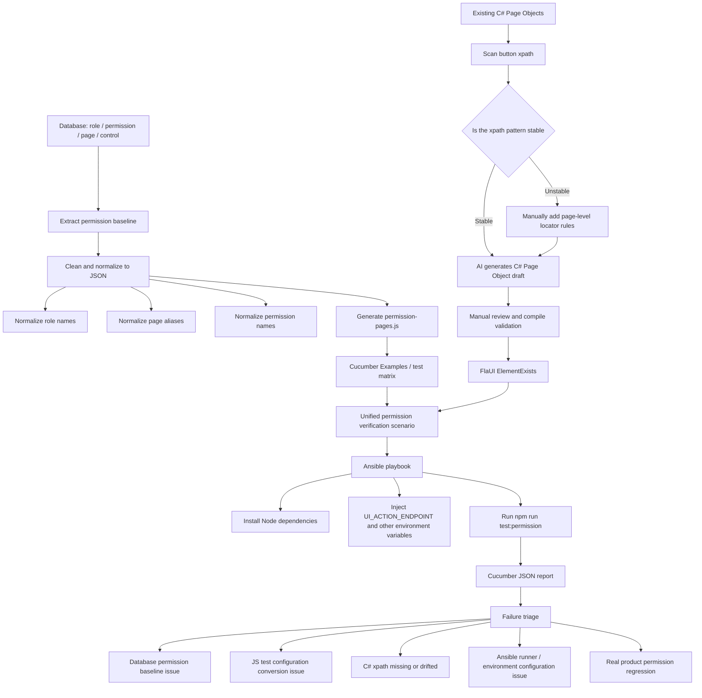

# Desktop Permission Test Example

This is a sanitized example of how to organize desktop permission automation tests.

Core ideas:

- Cucumber feature files describe only the shared business flow.
- JS configuration files maintain pages, navigation paths, and expected role permissions.
- Backend Page Objects continue to maintain xpath definitions and return whether elements exist through `elementExists`.
- Frontend step definitions call `click`, `edit`, and `elementExists`, then assert permissions.
- `ElementExists` returns `data[0].exists` through the existing `ResultDto<List<Dictionary<string, string>>>`, and the frontend converts `"true"` / `"false"` into booleans.

The page alias is standardized as `客户端`.

## Directory

```text
features/
  operator-role-permission.feature
  step_definitions/
    permission.steps.js
  support/
    permission-pages.js
utils/
  ui_request.js
examples/
  csharp/
    PageObjectExamples.cs
  permission-baseline.sample.json
ansible.cfg
ansible/
  inventory/
    local.ini
  playbooks/
    run-permission-tests.yml
```

## Usage

Replace or adapt `utils/ui_request.js` to your existing backend action invocation layer. In a real project that already has `utils/ui_request.js`, you can migrate only the organization pattern from `features` and `permission-pages.js`.

The default action service endpoint is `http://localhost:5000/actions`, which can be overridden through `UI_ACTION_ENDPOINT`. The default app alias is `客户端`, which can be overridden through `globalThis.appName` or `UI_APP_NAME`.

Database extracts should first be written to a JSON intermediate format, then converted into `features/support/permission-pages.js`. See `examples/permission-baseline.sample.json` for an example. The core fields are `role`, `page`, `permission`, and `expectedExists`; page navigation paths are stored in `navigationByPage`.

Permission tests can also be run through Ansible:

```bash
ansible-playbook ansible/playbooks/run-permission-tests.yml
```

The default inventory is `ansible/inventory/local.ini`, which runs `npm run test:permission` in the current WSL/Linux runner. Real environments can override `permission_test_workspace`, `ui_action_endpoint`, administrator credentials, and `operator_credentials_environment`.

## Roadmap

When the desktop app has many pages, the test expansion path splits into two data flows: one extracts role permissions from the database into a JSON intermediate format and converts it into JS test configuration; the other derives xpath patterns from existing Page Objects and uses them to help generate C# Page Objects. Both flows eventually feed the Ansible-driven Cucumber permission scenario.



Recommended implementation order:

1. Define the JSON intermediate format for database extracts. It should contain at least `role`, `page`, `permission`, and `expectedExists`.
2. Write a converter script that generates `features/support/permission-pages.js` from the intermediate format, avoiding manual maintenance of large page matrices.
3. Scan button xpath definitions in existing C# Page Objects and determine whether common buttons can use stable patterns such as `//Button[@Name='查询']`.
4. Once the pattern is stable, use AI to generate C# Page Object drafts, with manual review, compilation, and a small smoke run as the acceptance gate.
5. Move test execution into an Ansible playbook, using inventory to manage the runner path, action service endpoint, and account environment variables.
6. Finally, wire the generated JS configuration and C# Page Objects into the existing Cucumber scenario, using reports to distinguish permission data issues, conversion issues, xpath issues, runner configuration issues, and real regressions.
