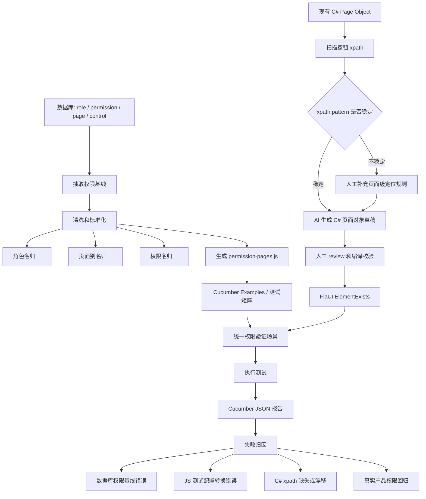

# Desktop Permission Test Example

这是一个脱敏后的桌面端权限自动化测试组织示例。

核心思路：

- Cucumber feature 只描述通用业务流程。
- JS 配置文件维护页面、导航路径、角色期望权限。
- 后端 Page Object 继续维护 xpath，并通过 `elementExists` 返回元素是否存在。
- 前端 step definition 调用 `click`、`edit`、`elementExists`，并完成权限断言。
- `ElementExists` 通过现有 `ResultDto<List<Dictionary<string, string>>>` 返回 `data[0].exists`，前端把 `"true"` / `"false"` 转成布尔值。

页面别名统一使用 `客户端`。

## 目录

```text
features/
  operator-role-permission.feature
  step_definitions/
    permission.steps.js
  support/
    permission-pages.js
utils/
  ui_request.js
examples/
  csharp/
    PageObjectExamples.cs
```

## 使用方式

把 `utils/ui_request.js` 替换或改造成你们现有的后端 action 调用层即可。真实项目里如果已经有 `utils/ui_request.js`，可以只迁移 `features` 和 `permission-pages.js` 的组织方式。

默认 action 服务地址为 `http://localhost:5000/actions`，可通过 `UI_ACTION_ENDPOINT` 覆盖；默认应用别名为 `客户端`，可通过 `globalThis.appName` 或 `UI_APP_NAME` 覆盖。

## 后续计划

面对大量桌面端页面时，测试扩展的主线分成两条数据流：一条从数据库抽取角色权限并生成 JS 测试配置，另一条从现有页面对象归纳 xpath pattern 并辅助生成 C# Page Object。两条流最终都汇入同一个 Cucumber 权限场景。



建议实施顺序：

1. 先定义数据库抽取结果的中间格式，字段至少包含 `role`、`page`、`permission`、`expectedExists`。
2. 再写转换脚本，把中间格式生成 `features/support/permission-pages.js`，避免手工维护大量页面矩阵。
3. 同步扫描现有 C# Page Object 的按钮 xpath，判断常见按钮是否能用 `//Button[@Name='查询']` 这类稳定 pattern。
4. pattern 稳定后，用 AI 生成 C# 页面对象草稿，但仍以人工 review、编译和少量冒烟运行为准入门槛。
5. 最后把生成的 JS 配置和 C# Page Object 接入现有 Cucumber 场景，用报告区分权限数据问题、转换问题、xpath 问题和真实回归。
